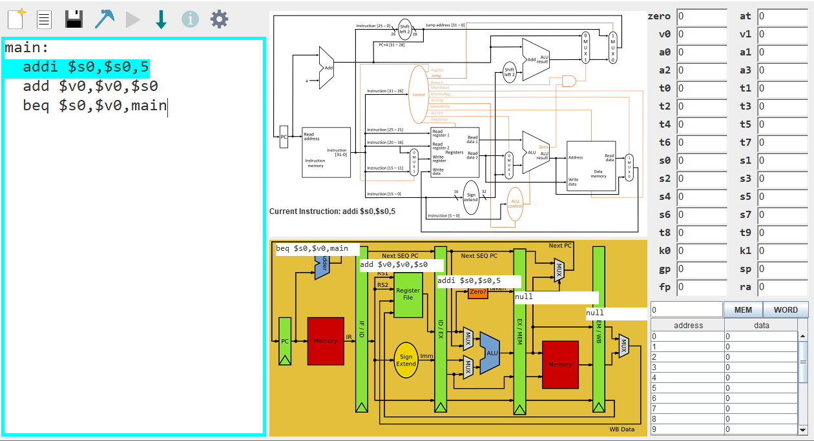
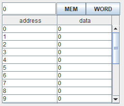
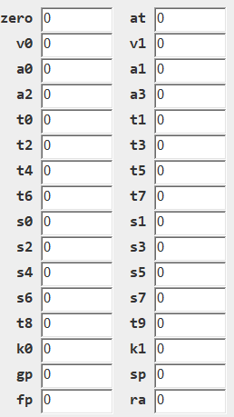
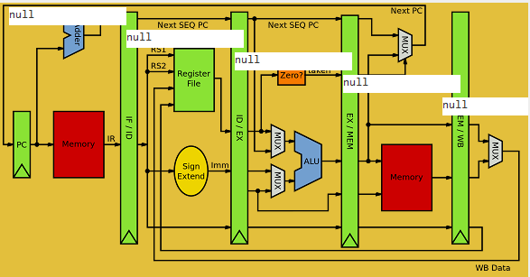

快來看看全新的MIPS模擬器!
=========================

 

專案介紹
--------

我們專案的目標是要製造出一個模擬32位元MIPS指令的模擬器，並實現先前可以執行MIPS指令的模擬器沒有做出的功能，即圖示化的Pipeline
Datapath。

GUI介紹
-------

 建立新的檔案
 一次執行到底 \
 開啟舊檔
 一行行執行 \
 儲存檔案
 關於mdImages資訊 \
 程式的組譯
 可設定畫質、檢查更新 

### 記憶體搜尋區塊

 

我們可以透過這個區域得知輸入值記憶體的資訊（MEM）或者是以字組（WORD，MIPS一個WORD等於四個Bytes）

### 暫存器（Register）的資訊

 

### Pipeline Datapath

 \
\
這裡會顯示pipeline的執行過程，並會顯示危障及前饋的狀況。 

支援的指令
----------

### R-type指令：

ADD、SUB、AND、OR、NOR、SLT、SLL、SRL

### I-type指令：

ADDI、LW、SW、ANDI、ORI、BEQ、BNE、SLTI

### J-type指令：

J
